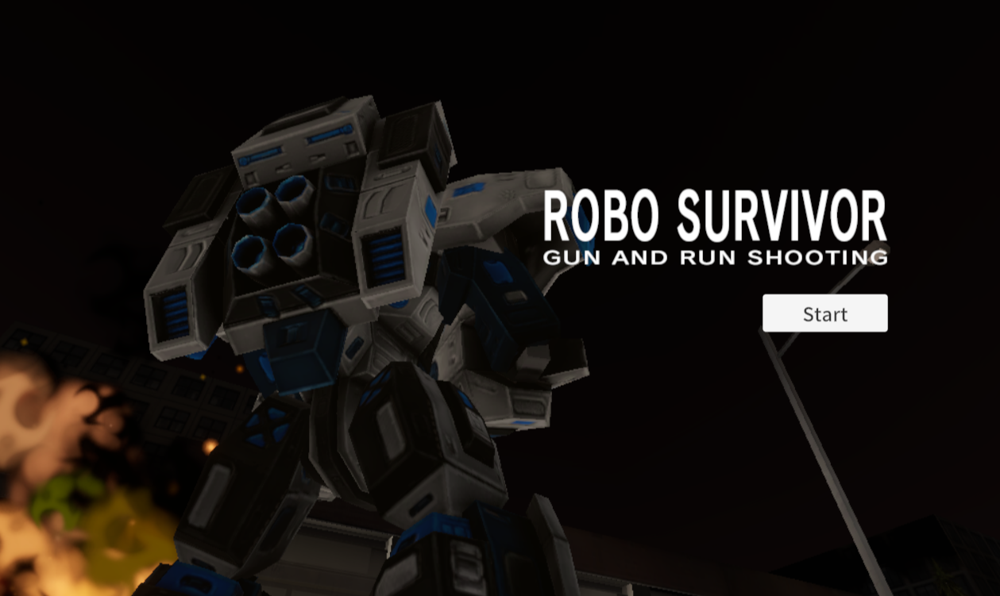
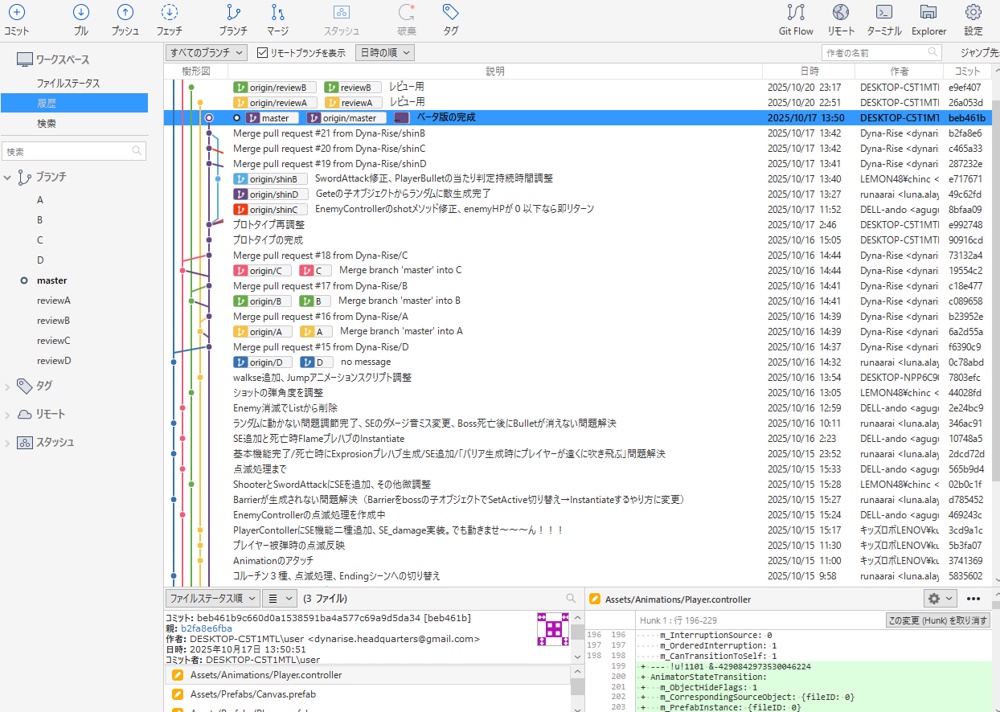
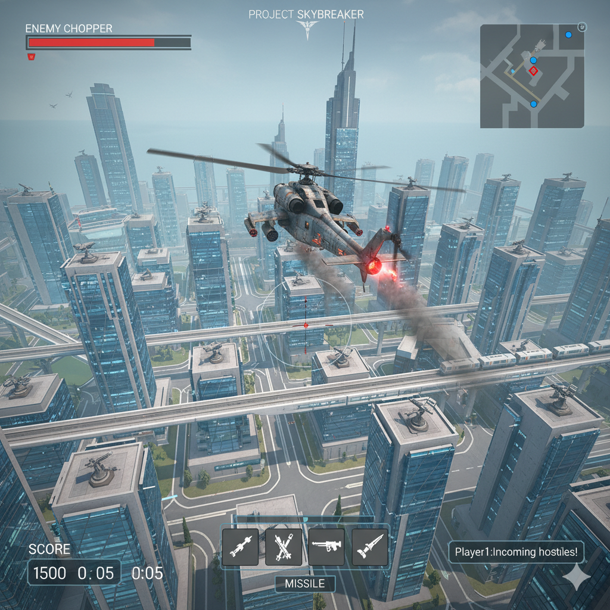

# RovoSurvivor（共同製作ゲーム）
## プロジェクト概要
RovoSurvivorは4名チームで共同製作したUnityゲームです。  
タイトルの通りロボットを動かす3Dアクションゲームです。  
エネミーを無限生成するゲートを潰しながら最後にボスを撃破することを目的とした爽快なゲームです。  
  
  
  

* 制作人数：4名  
* 制作期間：4日間  
* 使用エンジン：Unity Editorバージョン 6000.0.54f1 
* シーンレンダー：Universal 3D 
* 使用言語：C#  
* 使用アセット：（いずれもUnityアセットストアから）  
 Demo City By Versatile Studio (Mobile Friendly) →　バトルフィールド  
 Robot Hero : PBR HP Polyart　→　プレイヤーとエネミーのモデル  
 Delivery Robot　→　ボスモデル  
 Slash Effects FREE　→　エフェクト：接近攻撃のブレード  
 Free Quick Effects Vol. 1 →　エネミーを生産するゲートモデルや爆発・炎のエフェクト
* Fontデータ： Noto Sans JP-Medium SDF (TMP_Font Asset)  
* そのほかの使用ツール：GitHub、SorceTree、VisualStudio、Googleドライブ(スプレッドシート)で情報共有

## サンプルゲーム
ゲームの容量が大きいためプレイできる環境を構築中  
[RoboSurvivorサンプル](http://)

## ゲームフロー
* タイトル  
  
  
* オープニングシーン  
ストーリーの説明をしながらこれからバトルが始まるという緊張感を高めます  
  

* ゲームステージ（操作パート）  
街中のエネミーを殲滅します！  
画面右の指示にしたがって行動をすることになります。  
まずはエネミーを無限に生成するゲートを叩き、生き残ったエネミーを殲滅するといよいよボスステージです！  
  
  
* ボスステージ（操作パート）  
ボスステージに移行すると巨大なボスロボとのバトルになります。  
ボスは距離に応じた複数のアクションをとるので、行動を見極めながら攻撃を叩きこみます。  
BOSSのライフを0にすることができたらボス撃破！エンディングシーンへと続きます。  
  

* エンディングシーン  
エンディングでは悲しげなBGMにあわせて、ひとときの休息を得たことを告げるテキストを読み上げます。  
カメラワークが最後に天を見上げたところでタイトルに戻ります。  
  
  
## 操作方法
前後・左右　移動：WASDキー、または矢印キー  
ジャンプ：スペースキー  
プレイヤーの視点：マウス  
ショット攻撃：マウス左クリック　※弾数制限あるので打ちすぎ注意  
接近攻撃（ブレード）：マウス右  
  
プレイヤーにもライフがあり、ライフ0でゲームオーバーとなるので注意！  
  
  
## 共同製作における主な担当パート
共同製作では主にカメラの制御、弾の制御、接近攻撃の制御を担当しました。  
カメラは常にプレイヤーの背後に回り込むようにCameraController.csを構築しました。  
弾と接近攻撃はプレイヤーの位置や向きによって見た目に差異がないようにShooter.csとSwordAttack.csを構築しました。
  
### カメラの制御  
カメラはプレイヤーを少し離れた位置から見下ろすようにカメラの中心にとらえ続け、プレイヤーの向いた方向に合わせてカメラの方向も変化します。  
そのために考えたことは以下の2つです。  
- プレイヤーとの距離を常に観測してカメラの位置を変更する
- プレイヤーの角度とカメラの角度を同期させる
  
```C#
private void LateUpdate()
{
  if (GameManager.gameState != GameState.playing) return;
  if (player == null) return;

  //マウスの動きを取得
  float mouseX = Input.GetAxis("Mouse X") * mouseSensitivity;
  float mouseY = Input.GetAxis("Mouse Y") * mouseSensitivity;

  //プレイヤーの左右回転
  player.transform.Rotate(new Vector3(0, mouseX, 0));

  //縦方向(マイナスにして動かしやすく)
  verticalRotation = Mathf.Clamp(verticalRotation - mouseY, minVerticalAngle, maxVerticalAngle);

  //プレイヤーの現在の位置と回転に基づいて、
  //カメラの目標位置を計算する
  //プレイヤーの回転を考慮したオフセット位置
  Vector3 targetCameraPosition = player.transform.position - player.transform.rotation * diff;

  //カメラの位置を決定
  transform.position = Vector3.Lerp(transform.position, targetCameraPosition, followSpeed * Time.deltaTime);

  //カメラの角度
  Quaternion targetRotation =
  Quaternion.Euler(0, player.transform.eulerAngles.y, 0) *
  Quaternion.Euler(verticalRotation, 0, 0);
  //カメラの角度を決定
  transform.rotation = Quaternion.Slerp(transform.rotation, targetRotation, followSpeed * Time.deltaTime);
  }
}
```
  
### 弾の制御
弾のプレハブをそのまま生成するだけでは撃つ方向に関係なく弾の向きが変わらないという問題がありました。  
その解決のため、生成される際の角度を発射口の向きに合わせて発射されるように工夫をしました。  
また、発射する際の力の成分が水平方向だけだと画面中央に飛ばなかったためY軸方向にも少しだけ力を加える工夫もしました。  

```C#
//ショットメソッド
void Shot()
{
  //残弾数が0なら何もしない
  if (GameManager.shotRemainingNum <= 0)
  {
  return;
  }

  GameManager.shotRemainingNum--;
  isAttack = true;
  //ショット音を鳴らす
  audioSource.PlayOneShot(se_shot);

  //弾を生成
  GameObject obj = Instantiate(
  bulletPrefab,
  gate.transform.position,
  gate.transform.rotation * Quaternion.Euler(90, 0, 0)
  );

  //カメラの方向に弾を飛ばす
  Vector3 v = Camera.main.transform.forward;
  //照準どおりに飛ぶように調整
  v.y += 0.2f;

  obj.GetComponent<Rigidbody>().AddForce(v * shootPower, ForceMode.Impulse);
  //リロードを開始
  StartCoroutine(ShotRecoverCoroutine());
  //連射できないように0.2秒後に攻撃フラグをOFF
  Invoke("CanShot", 0.2f);
}
```

### 接近攻撃（ブレード）の制御
接近攻撃もプレイヤーの向きに合わせて角度が変化するのは弾と同じです。  
ただし、そのまま実装してしまうとブレードのエフェクトをその場に置いたままプレイヤーが移動してしまう問題がありました。  
その解決のために、ブレードのエフェクトをブレードの子オブジェクトにすることにより一緒に移動するようにしました。  

```c#
//攻撃メソッド
void Attack()
{
  //攻撃フラグを立てて硬直時間の計測を開始
  isAttack = true;
  StartCoroutine(SwordAttackCoroutine());

  //アタック音を鳴らす
  audioSource.PlayOneShot(se_sword);

  //当たり判定出現
  swordCollider.SetActive(true);
  //エフェクトを生成
  GameObject obj = Instantiate(
  swordPrefab,
  swordCollider.transform.position,
  swordCollider.transform.rotation
  );
  //エフェクトをブレードの子オブジェクトにして位置を同期させる
  obj.transform.SetParent(swordCollider.transform);
}
```

## 共同開発におけるレビューを行いブラッシュアップ
まずは最初の2日間でプロトタイプを完成させるために担当箇所を構築しました。  
それぞれの担当箇所をGitHubを活用してマージし、当日デバッグに回れるメンバーでデバッグプレイしてプロトタイプへの評価を行いました。  
この評価に関してチームミーティングを行い、改善点と改善方法を定め残りの2日間で調整を行うことでブラッシュアップできました。  
  
  
  
## GitHub上でのマージ作業を意識して担当範囲に最新の注意
スピードが要求される制作期間において、マージ作業で大きなトラブルを生まないようチームの取り決めを忠実に順守しました。  
GitHubのIssuesを通じて進捗や問題点については随時チームへの報告や問題提起を行っています。
  
  
SourceTreeでブランチを分けてコンクリフト衝突がおこらないよう細心の注意を払いました。  
また定期的なコミットを通してバックアップも万全にしました。  
  
  
## 共同開発に関する工夫
### 仕様から反れていないかの確認作業
チームの打ち合わせで大体の方向性・仕様はあったものの、細かい部分は自身の考えに委ねられる環境でした。  
私の場合はとにかくユーザーがどう操作してもバグが起きないことを気にしました。  
一方でこだわった結果、時間をかけすぎてしまったり、他の担当部分に影響が出ないかが心配な部分でしたので、疑問に思った部分はチームリーダーにマメに確認をとり、マージする際の影響なども考えながら慎重に改良を重ねることができました。  
  
例えば、カメラの移動方法がこの方法で問題ないかをきちんと確認をいれました。チームリーダーからヒントをいただき結果として以下のように変更しました。  
変更前  
```c#
//プレイヤーの位置からdiffだけ離れた位置にカメラを移動
Vector3 targetCameraPosition = new Vector3(
  player.transform.position.x - Mathf.Sin(playerRotationY) * diff,
  player.transform.position.y * diff,
  player.transform.position.z - Mathf.Cos(playerRotationY) * diff
  );
```

変更後  
```c#
//プレイヤーの現在の位置と回転に基づいて、
//カメラの目標位置を計算する
//プレイヤーの回転を考慮したオフセット位置
Vector3 targetCameraPosition = player.transform.position - player.transform.rotation * diff;
```
  
### 細かいコミット作業
とにかく自分のデータにトラブルがあると、全体に影響が出てしまうので何か大きな変更を行う際にはコミットによるバージョン管理によって、いつでももとに戻れるように気を使いました。  
またコミットだけではなくプッシュを意識してクラウドにバックアップが常にある状態の維持に努めました。  
  
### 納期の意識
チーム開発ということで自分のせいで周りに影響がでないよう良い意味でプレッシャーを感じていたのですが、それ以上にこれをプレイするユーザーを意識して時間内に必ず間に合わせるという意識を大切にしました。そのために何日に何ができていないといけないという逆算に加え、さらに半日～1日余裕をもたせるようにスケジューリングしました。  
詰まってしまったところは、自分でこだわる部分とそうでない部分を「納期に間に合うか」で天秤にかけることで、リーダーに助力を乞うタイミングは基準を決めやすかったです。  
  
具体的には上方向に弾を発射しても弾の向きが水平のままになっていますが、チームリーダーに相談し納期を優先させることにして今回はそこはこだわりすぎないようにしました。
  
### AIの活用
自分で考えれる部分は多かったのですが、一部時短もかねてAIを大いに活用しました。  
しかし、AIが出したコードだけでは不十分なものも多かったので、大枠はAIの案を採用しつつも細部は自分で修正するという作業をしたことで出だしが早く無事納期に間に合わすことができたと思います。  
* 仕様ツール：Google AI Studio　「Gemini 2.5 Pro」

## 今後の課題
他の担当者のパートも含めゲーム全体の内容を理解はしていますが、上空を飛び交うヘリのようなNavMeshAgentコンポーネントを活用しづらいコードについては未挑戦なので、ぜひ次回以降に作ってみようと思います。  
調べたところ、いくつかの方法のうちエネミーのルーティングを行うのが一番自然だと感じましたので挑戦してみます。  
[参考サイト：Unity入門の森/移動経路の構築とOnDrawGizmosによる移動経路の可視化](https://feynman.co.jp/unityforest/game-create-lesson/tower-defense-game/enemy-route/)
  
  
